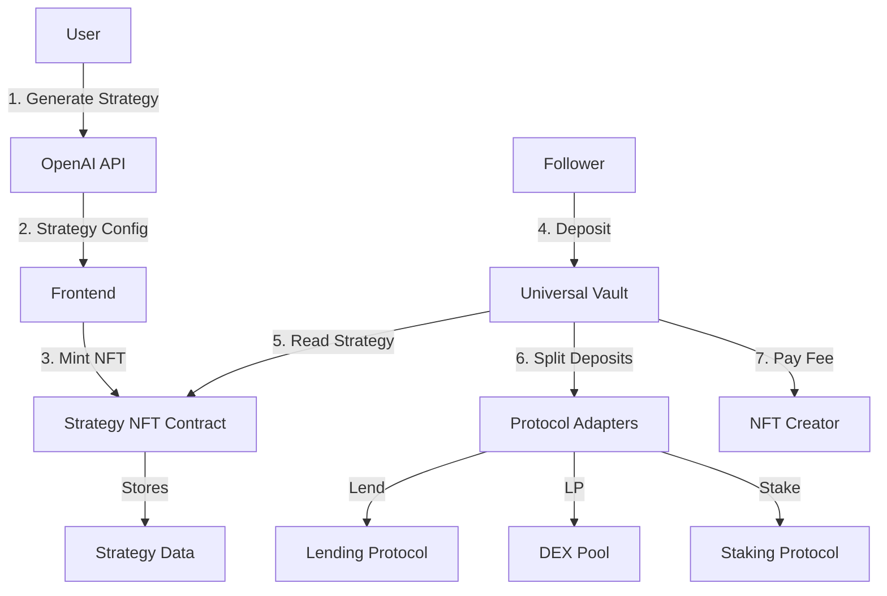

# Mantle Strategy Studio - Technical Implementation Plan

**Project Goal:** Build an MVP DeFi platform where users generate AI-powered investment strategies, mint them as NFTs, and allow others to copy these strategies through a Dynamic Universal Vault that dynamically routes deposits based on on-chain strategy data.

---

## 1. Smart Contract Architecture

### 1.1 Core Contracts Overview



---

### 1.2 Strategy NFT Contract

This contract stores the strategy configuration on-chain and enforces validation rules.

#### Strategy Struct Design

```solidity
// SPDX-License-Identifier: MIT
pragma solidity ^0.8.20;

import "@openzeppelin/contracts/token/ERC721/ERC721.sol";
import "@openzeppelin/contracts/access/Ownable.sol";

contract StrategyNFT is ERC721, Ownable {
    struct Strategy {
        string name;                    // e.g., "Conservative Yield"
        address[] adapters;             // Whitelisted adapter contracts
        uint16[] ratios;                // Allocation percentages (basis points, 10000 = 100%)
        address creator;                // Strategy creator (fee recipient)
        uint16 creatorFeeBps;          // Creator fee in basis points (e.g., 10 = 0.1%)
        uint64 createdAt;              // Timestamp
        bool isActive;                 // Can be deactivated by creator or admin
    }
    
    // State
    uint256 private _nextTokenId = 1;
    mapping(uint256 => Strategy) public strategies;
    mapping(address => bool) public whitelistedAdapters;
    
    // Constants
    uint16 public constant MAX_ADAPTERS = 10;
    uint16 public constant TOTAL_BPS = 10000; // 100%
    uint16 public constant MAX_CREATOR_FEE_BPS = 500; // Max 5% creator fee
    
    // Events
    event StrategyMinted(uint256 indexed tokenId, address indexed creator, string name);
    event StrategyDeactivated(uint256 indexed tokenId);
    event AdapterWhitelisted(address indexed adapter, bool status);
    
    constructor() ERC721("Mantle Strategy", "MSTR") {}
    
    /**
     * @notice Mint a new strategy NFT
     * @param name Strategy name
     * @param adapters Array of adapter addresses
     * @param ratios Array of allocation percentages (basis points)
     * @param creatorFeeBps Creator fee (basis points)
     */
    function mintStrategy(
        string memory name,
        address[] memory adapters,
        uint16[] memory ratios,
        uint16 creatorFeeBps
    ) external returns (uint256) {
        // Validation
        require(adapters.length > 0 && adapters.length <= MAX_ADAPTERS, "Invalid adapter count");
        require(adapters.length == ratios.length, "Adapters and ratios length mismatch");
        require(creatorFeeBps <= MAX_CREATOR_FEE_BPS, "Creator fee too high");
        
        // Validate adapters are whitelisted
        for (uint i = 0; i < adapters.length; i++) {
            require(whitelistedAdapters[adapters[i]], "Adapter not whitelisted");
        }
        
        // Validate ratios sum to 100%
        uint256 totalRatio = 0;
        for (uint i = 0; i < ratios.length; i++) {
            require(ratios[i] > 0, "Ratio must be > 0");
            totalRatio += ratios[i];
        }
        require(totalRatio == TOTAL_BPS, "Ratios must sum to 100%");
        
        // Mint NFT
        uint256 tokenId = _nextTokenId++;
        _safeMint(msg.sender, tokenId);
        
        // Store strategy
        strategies[tokenId] = Strategy({
            name: name,
            adapters: adapters,
            ratios: ratios,
            creator: msg.sender,
            creatorFeeBps: creatorFeeBps,
            createdAt: uint64(block.timestamp),
            isActive: true
        });
        
        emit StrategyMinted(tokenId, msg.sender, name);
        return tokenId;
    }
    
    /**
     * @notice Deactivate a strategy (only creator or owner)
     */
    function deactivateStrategy(uint256 tokenId) external {
        require(_exists(tokenId), "Strategy does not exist");
        Strategy storage strategy = strategies[tokenId];
        require(
            msg.sender == strategy.creator || msg.sender == owner(),
            "Not authorized"
        );
        strategy.isActive = false;
        emit StrategyDeactivated(tokenId);
    }
    
    /**
     * @notice Whitelist/delist an adapter (admin only)
     */
    function setAdapterWhitelist(address adapter, bool status) external onlyOwner {
        whitelistedAdapters[adapter] = status;
        emit AdapterWhitelisted(adapter, status);
    }
    
    /**
     * @notice Get strategy details
     */
    function getStrategy(uint256 tokenId) external view returns (Strategy memory) {
        require(_exists(tokenId), "Strategy does not exist");
        return strategies[tokenId];
    }
}
```

**Key Design Decisions:**
- **Basis Points:** Use `uint16` for ratios (0-10000) to represent percentages with 2 decimal precision (e.g., 2550 = 25.50%)
- **Validation:** On-chain validation ensures ratios sum to exactly 100% and all adapters are whitelisted
- **Deactivation:** Creators can pause their strategy if they discover issues
- **Storage Optimization:** Use smaller uint types (`uint16`, `uint64`) to reduce gas costs

---

### 1.3 Universal Vault Contract

This is the **core innovation** - a vault that dynamically routes deposits based on NFT strategy data.

```solidity
// SPDX-License-Identifier: MIT
pragma solidity ^0.8.20;

import "@openzeppelin/contracts/token/ERC20/IERC20.sol";
import "@openzeppelin/contracts/token/ERC20/utils/SafeERC20.sol";
import "@openzeppelin/contracts/security/ReentrancyGuard.sol";
import "./StrategyNFT.sol";
import "./IAdapter.sol";

contract UniversalVault is ReentrancyGuard {
    using SafeERC20 for IERC20;
    
    // State
    StrategyNFT public immutable strategyNFT;
    IERC20 public immutable depositToken; // e.g., USDC
    
    // Tracking deposits per user per strategy
    mapping(uint256 => mapping(address => uint256)) public userDeposits; // strategy => user => amount
    mapping(uint256 => uint256) public totalDepositsPerStrategy; // strategy => total
    
    // Fee tracking
    mapping(uint256 => uint256) public accumulatedCreatorFees; // strategy => fees
    
    uint16 public constant TOTAL_BPS = 10000;
    uint16 public constant PLATFORM_FEE_BPS = 10; // 0.1% platform fee
    address public platformFeeRecipient;
    
    // Events
    event Deposited(uint256 indexed strategyId, address indexed user, uint256 amount);
    event Withdrawn(uint256 indexed strategyId, address indexed user, uint256 amount);
    event CreatorFeePaid(uint256 indexed strategyId, address indexed creator, uint256 amount);
    
    constructor(address _strategyNFT, address _depositToken, address _platformFeeRecipient) {
        strategyNFT = StrategyNFT(_strategyNFT);
        depositToken = IERC20(_depositToken);
        platformFeeRecipient = _platformFeeRecipient;
    }
    
    /**
     * @notice Deposit funds into a strategy
     * @param strategyId The NFT token ID representing the strategy
     * @param amount Amount of deposit tokens
     */
    function deposit(uint256 strategyId, uint256 amount) external nonReentrant {
        require(amount > 0, "Amount must be > 0");
        
        // Get strategy
        StrategyNFT.Strategy memory strategy = strategyNFT.getStrategy(strategyId);
        require(strategy.isActive, "Strategy is not active");
        
        // Transfer tokens from user
        depositToken.safeTransferFrom(msg.sender, address(this), amount);
        
        // Deduct fees
        uint256 creatorFee = (amount * strategy.creatorFeeBps) / TOTAL_BPS;
        uint256 platformFee = (amount * PLATFORM_FEE_BPS) / TOTAL_BPS;
        uint256 netAmount = amount - creatorFee - platformFee;
        
        // Track fees
        accumulatedCreatorFees[strategyId] += creatorFee;
        depositToken.safeTransfer(platformFeeRecipient, platformFee);
        
        // Execute strategy splits
        _executeStrategy(strategy, netAmount);
        
        // Update accounting
        userDeposits[strategyId][msg.sender] += netAmount;
        totalDepositsPerStrategy[strategyId] += netAmount;
        
        emit Deposited(strategyId, msg.sender, amount);
    }
    
    /**
     * @notice Internal function to split deposits across adapters
     */
    function _executeStrategy(
        StrategyNFT.Strategy memory strategy,
        uint256 amount
    ) internal {
        uint256 remaining = amount;
        
        for (uint i = 0; i < strategy.adapters.length; i++) {
            uint256 adapterAmount;
            
            // For the last adapter, use remaining amount to avoid rounding dust
            if (i == strategy.adapters.length - 1) {
                adapterAmount = remaining;
            } else {
                adapterAmount = (amount * strategy.ratios[i]) / TOTAL_BPS;
                remaining -= adapterAmount;
            }
            
            if (adapterAmount > 0) {
                // Approve and deposit to adapter
                depositToken.safeApprove(strategy.adapters[i], adapterAmount);
                IAdapter(strategy.adapters[i]).deposit(adapterAmount);
            }
        }
    }
    
    /**
     * @notice Withdraw funds from a strategy
     * @param strategyId Strategy to withdraw from
     * @param amount Amount to withdraw (0 = withdraw all)
     */
    function withdraw(uint256 strategyId, uint256 amount) external nonReentrant {
        uint256 userBalance = userDeposits[strategyId][msg.sender];
        require(userBalance > 0, "No deposits found");
        
        uint256 withdrawAmount = (amount == 0) ? userBalance : amount;
        require(withdrawAmount <= userBalance, "Insufficient balance");
        
        // Get strategy
        StrategyNFT.Strategy memory strategy = strategyNFT.getStrategy(strategyId);
        
        // Calculate proportional withdrawal from each adapter
        uint256 totalWithdrawn = _withdrawFromAdapters(strategy, strategyId, withdrawAmount);
        
        // Update accounting
        userDeposits[strategyId][msg.sender] -= withdrawAmount;
        totalDepositsPerStrategy[strategyId] -= withdrawAmount;
        
        // Transfer tokens to user
        depositToken.safeTransfer(msg.sender, totalWithdrawn);
        
        emit Withdrawn(strategyId, msg.sender, totalWithdrawn);
    }
    
    /**
     * @notice Withdraw proportionally from all adapters
     */
    function _withdrawFromAdapters(
        StrategyNFT.Strategy memory strategy,
        uint256 strategyId,
        uint256 amount
    ) internal returns (uint256) {
        uint256 totalWithdrawn = 0;
        uint256 totalDeposits = totalDepositsPerStrategy[strategyId];
        
        for (uint i = 0; i < strategy.adapters.length; i++) {
            // Calculate proportional amount from this adapter
            uint256 adapterAmount = (amount * strategy.ratios[i]) / TOTAL_BPS;
            
            if (adapterAmount > 0) {
                uint256 withdrawn = IAdapter(strategy.adapters[i]).withdraw(adapterAmount);
                totalWithdrawn += withdrawn;
            }
        }
        
        return totalWithdrawn;
    }
    
    /**
     * @notice Claim accumulated creator fees
     */
    function claimCreatorFees(uint256 strategyId) external nonReentrant {
        StrategyNFT.Strategy memory strategy = strategyNFT.getStrategy(strategyId);
        require(msg.sender == strategy.creator, "Not strategy creator");
        
        uint256 fees = accumulatedCreatorFees[strategyId];
        require(fees > 0, "No fees to claim");
        
        accumulatedCreatorFees[strategyId] = 0;
        depositToken.safeTransfer(strategy.creator, fees);
        
        emit CreatorFeePaid(strategyId, strategy.creator, fees);
    }
    
    /**
     * @notice Get user's position in a strategy
     */
    function getUserPosition(uint256 strategyId, address user) 
        external 
        view 
        returns (uint256 deposited, uint256 estimatedValue) 
    {
        deposited = userDeposits[strategyId][user];
        // TODO: Calculate current value by querying adapters
        estimatedValue = deposited; // Simplified for MVP
    }
}
```

**Key Design Decisions:**

1. **Fee Structure:**
   - **Creator Fee:** Taken on deposit (0.1% - 5%), configurable per strategy
   - **Platform Fee:** Fixed 0.1% on all deposits
   - **Fee Timing:** Deducted upfront to avoid complex yield tracking for MVP

2. **Dynamic Routing:**
   - Loop through `adapters[]` and `ratios[]` from the NFT
   - Use basis points math to split deposits
   - Handle rounding by giving last adapter the remaining dust

3. **Approval Pattern:**
   - Vault approves each adapter just-in-time
   - Resets approval after each deposit for security

4. **Withdrawal Logic:**
   - Proportional withdrawal from all adapters
   - User specifies amount in deposit tokens, vault calculates shares

---

### 1.4 Adapter Interface

Adapters are the abstraction layer between the vault and external protocols.

```solidity
// SPDX-License-Identifier: MIT
pragma solidity ^0.8.20;

/**
 * @title IAdapter
 * @notice Standard interface for protocol adapters
 */
interface IAdapter {
    /**
     * @notice Deposit tokens into the underlying protocol
     * @param amount Amount of base token to deposit
     * @return shares Amount of shares/receipt tokens received
     */
    function deposit(uint256 amount) external returns (uint256 shares);
    
    /**
     * @notice Withdraw tokens from the underlying protocol
     * @param amount Amount of base token to withdraw
     * @return withdrawn Actual amount withdrawn
     */
    function withdraw(uint256 amount) external returns (uint256 withdrawn);
    
    /**
     * @notice Get the current value of deposits
     * @return value Current value in base tokens
     */
    function getBalance() external view returns (uint256 value);
    
    /**
     * @notice Get the underlying protocol name
     */
    function protocolName() external view returns (string memory);
}
```

#### Example Adapter: Lending Protocol

```solidity
// SPDX-License-Identifier: MIT
pragma solidity ^0.8.20;

import "@openzeppelin/contracts/token/ERC20/IERC20.sol";
import "./IAdapter.sol";

// Mock interface for a lending protocol (like Aave)
interface ILendingPool {
    function supply(address asset, uint256 amount, address onBehalfOf) external;
    function withdraw(address asset, uint256 amount, address to) external returns (uint256);
}

contract LendingAdapter is IAdapter {
    IERC20 public immutable depositToken;
    ILendingPool public immutable lendingPool;
    address public immutable vault;
    
    modifier onlyVault() {
        require(msg.sender == vault, "Only vault");
        _;
    }
    
    constructor(address _depositToken, address _lendingPool, address _vault) {
        depositToken = IERC20(_depositToken);
        lendingPool = ILendingPool(_lendingPool);
        vault = _vault;
    }
    
    function deposit(uint256 amount) external onlyVault returns (uint256) {
        depositToken.transferFrom(vault, address(this), amount);
        depositToken.approve(address(lendingPool), amount);
        lendingPool.supply(address(depositToken), amount, address(this));
        return amount; // Simplified: 1:1 for MVP
    }
    
    function withdraw(uint256 amount) external onlyVault returns (uint256) {
        uint256 withdrawn = lendingPool.withdraw(address(depositToken), amount, vault);
        return withdrawn;
    }
    
    function getBalance() external view returns (uint256) {
        // Query lending pool for current balance
        // Simplified for MVP
        return depositToken.balanceOf(address(this));
    }
    
    function protocolName() external pure returns (string memory) {
        return "Lending Protocol";
    }
}
```

---

## 2. Frontend Architecture

### 2.1 Tech Stack

```
Next.js 14 (App Router)
├── TypeScript
├── Wagmi v2 (Web3 hooks)
├── Viem (Ethereum interactions)
├── TanStack Query (async state)
├── Zustand (client state)
├── OpenAI SDK (strategy generation)
└── Tailwind CSS (styling)
```

---

### 2.2 OpenAI Integration → Strategy State Flow

#### Step 1: OpenAI Prompt Engineering

```typescript
// app/api/generate-strategy/route.ts
import { OpenAI } from 'openai';
import { NextRequest, NextResponse } from 'next/server';

const openai = new OpenAI({ apiKey: process.env.OPENAI_API_KEY });

// Whitelisted adapters (hardcoded for MVP)
const WHITELISTED_ADAPTERS = {
  'LENDING_PROTOCOL': '0x1234...', // Replace with actual deployed address
  'DEX_LP_POOL': '0x5678...',
  'STAKING_VAULT': '0x9abc...',
};

export async function POST(req: NextRequest) {
  const { riskProfile, investmentGoal, amount } = await req.json();
  
  // Construct system prompt
  const systemPrompt = `You are a DeFi portfolio strategist. Generate a diversified strategy using ONLY these protocols:
  - LENDING_PROTOCOL (Low risk, stable yield)
  - DEX_LP_POOL (Medium risk, liquidity mining)
  - STAKING_VAULT (Medium-high risk, staking rewards)
  
  Return a JSON object with this exact structure:
  {
    "name": "Strategy name (max 50 chars)",
    "description": "Brief explanation",
    "allocations": [
      { "protocol": "LENDING_PROTOCOL", "percentage": 60 },
      { "protocol": "DEX_LP_POOL", "percentage": 30 },
      { "protocol": "STAKING_VAULT", "percentage": 10 }
    ],
    "expectedAPY": "8-12%",
    "riskLevel": "Medium"
  }
  
  Rules:
  - Percentages MUST sum to exactly 100
  - Use 1-3 protocols
  - Match the user's risk profile: ${riskProfile}`;
  
  try {
    const completion = await openai.chat.completions.create({
      model: 'gpt-4-turbo-preview',
      messages: [
        { role: 'system', content: systemPrompt },
        { role: 'user', content: `Create a ${riskProfile} risk strategy for ${investmentGoal} with $${amount}` }
      ],
      response_format: { type: 'json_object' },
      temperature: 0.7,
    });
    
    const strategy = JSON.parse(completion.choices[0].message.content!);
    
    // Validate and transform to contract format
    const adapters = strategy.allocations.map((a: any) => WHITELISTED_ADAPTERS[a.protocol as keyof typeof WHITELISTED_ADAPTERS]);
    const ratios = strategy.allocations.map((a: any) => a.percentage * 100); // Convert to basis points
    
    return NextResponse.json({
      ...strategy,
      contractParams: { adapters, ratios }
    });
  } catch (error) {
    return NextResponse.json({ error: 'Failed to generate strategy' }, { status: 500 });
  }
}
```

---

#### Step 2: React State Management

```typescript
// lib/stores/strategyStore.ts
import { create } from 'zustand';

export interface AllocationItem {
  protocol: string;
  protocolName: string;
  percentage: number;
  address: string;
}

interface StrategyState {
  name: string;
  description: string;
  allocations: AllocationItem[];
  expectedAPY: string;
  riskLevel: string;
  creatorFeeBps: number; // 0-500 (0%-5%)
  
  // Actions
  setStrategy: (data: Partial<StrategyState>) => void;
  updateAllocation: (index: number, percentage: number) => void;
  setCreatorFee: (bps: number) => void;
  reset: () => void;
}

export const useStrategyStore = create<StrategyState>((set) => ({
  name: '',
  description: '',
  allocations: [],
  expectedAPY: '',
  riskLevel: 'Medium',
  creatorFeeBps: 10, // Default 0.1%
  
  setStrategy: (data) => set((state) => ({ ...state, ...data })),
  
  updateAllocation: (index, percentage) => set((state) => {
    const newAllocations = [...state.allocations];
    newAllocations[index].percentage = percentage;
    
    // Auto-adjust other allocations to sum to 100%
    const total = newAllocations.reduce((sum, a) => sum + a.percentage, 0);
    if (total !== 100) {
      // Distribute difference proportionally to other items
      const diff = 100 - total;
      const others = newAllocations.filter((_, i) => i !== index);
      const adjustment = diff / others.length;
      newAllocations.forEach((a, i) => {
        if (i !== index) a.percentage += adjustment;
      });
    }
    
    return { allocations: newAllocations };
  }),
  
  setCreatorFee: (bps) => set({ creatorFeeBps: Math.min(bps, 500) }),
  reset: () => set({
    name: '',
    description: '',
    allocations: [],
    expectedAPY: '',
    riskLevel: 'Medium',
    creatorFeeBps: 10,
  }),
}));
```

---

#### Step 3: UI Component (Strategy Builder)

```typescript
// components/StrategyBuilder.tsx
'use client';

import { useState } from 'react';
import { useStrategyStore } from '@/lib/stores/strategyStore';
import { useWriteContract, useWaitForTransactionReceipt } from 'wagmi';
import { parseUnits } from 'viem';
import { STRATEGY_NFT_ABI, STRATEGY_NFT_ADDRESS } from '@/lib/contracts';

export function StrategyBuilder() {
  const { name, allocations, creatorFeeBps, setCreatorFee } = useStrategyStore();
  const [isGenerating, setIsGenerating] = useState(false);
  
  const { writeContract, data: hash } = useWriteContract();
  const { isLoading: isMinting } = useWaitForTransactionReceipt({ hash });
  
  // Generate strategy from AI
  const handleGenerate = async (userInput: { risk: string; goal: string }) => {
    setIsGenerating(true);
    const res = await fetch('/api/generate-strategy', {
      method: 'POST',
      headers: { 'Content-Type': 'application/json' },
      body: JSON.stringify(userInput),
    });
    const data = await res.json();
    useStrategyStore.getState().setStrategy(data);
    setIsGenerating(false);
  };
  
  // Mint NFT
  const handleMint = async () => {
    if (!allocations.length) return;
    
    // Transform to contract params
    const adapters = allocations.map(a => a.address);
    const ratios = allocations.map(a => Math.round(a.percentage * 100)); // to basis points
    
    writeContract({
      address: STRATEGY_NFT_ADDRESS,
      abi: STRATEGY_NFT_ABI,
      functionName: 'mintStrategy',
      args: [name, adapters, ratios, creatorFeeBps],
    });
  };
  
  return (
    <div className="space-y-6">
      {/* AI Generation UI */}
      <div className="bg-white p-6 rounded-lg shadow">
        <h2 className="text-xl font-bold mb-4">Generate Strategy</h2>
        {/* Input fields for risk, goal, etc. */}
        <button onClick={() => handleGenerate({ risk: 'medium', goal: 'growth' })}>
          Generate with AI
        </button>
      </div>
      
      {/* Allocation Sliders */}
      {allocations.length > 0 && (
        <div className="bg-white p-6 rounded-lg shadow">
          <h3 className="text-lg font-semibold mb-4">Customize Allocations</h3>
          {allocations.map((allocation, index) => (
            <div key={index} className="mb-4">
              <label className="block text-sm font-medium mb-2">
                {allocation.protocolName}: {allocation.percentage}%
              </label>
              <input
                type="range"
                min="0"
                max="100"
                step="1"
                value={allocation.percentage}
                onChange={(e) => 
                  useStrategyStore.getState().updateAllocation(index, Number(e.target.value))
                }
                className="w-full"
              />
            </div>
          ))}
          
          {/* Creator Fee Slider */}
          <div className="mt-6">
            <label className="block text-sm font-medium mb-2">
              Creator Fee: {(creatorFeeBps / 100).toFixed(2)}%
            </label>
            <input
              type="range"
              min="0"
              max="500"
              step="10"
              value={creatorFeeBps}
              onChange={(e) => setCreatorFee(Number(e.target.value))}
              className="w-full"
            />
          </div>
        </div>
      )}
      
      {/* Mint Button */}
      <button
        onClick={handleMint}
        disabled={isMinting || !allocations.length}
        className="w-full bg-blue-600 text-white py-3 rounded-lg font-semibold"
      >
        {isMinting ? 'Minting...' : 'Mint Strategy NFT'}
      </button>
    </div>
  );
}
```

---

### 2.3 Contract Interaction Layer

```typescript
// lib/contracts/index.ts
import { Address } from 'viem';

export const STRATEGY_NFT_ADDRESS: Address = '0x...'; // Deploy address
export const UNIVERSAL_VAULT_ADDRESS: Address = '0x...';

// ABIs (simplified - generate full ABI from Hardhat)
export const STRATEGY_NFT_ABI = [
  {
    name: 'mintStrategy',
    type: 'function',
    stateMutability: 'nonpayable',
    inputs: [
      { name: 'name', type: 'string' },
      { name: 'adapters', type: 'address[]' },
      { name: 'ratios', type: 'uint16[]' },
      { name: 'creatorFeeBps', type: 'uint16' },
    ],
    outputs: [{ name: 'tokenId', type: 'uint256' }],
  },
  // ... other functions
] as const;

export const UNIVERSAL_VAULT_ABI = [
  {
    name: 'deposit',
    type: 'function',
    stateMutability: 'nonpayable',
    inputs: [
      { name: 'strategyId', type: 'uint256' },
      { name: 'amount', type: 'uint256' },
    ],
    outputs: [],
  },
  // ... other functions
] as const;
```

---

## 3. Step-by-Step Development Plan

### Team Structure (5 Developers)

1. **Smart Contract Lead** (Dev A) - Solidity expert
2. **Frontend Lead** (Dev B) - React/Next.js expert
3. **Web3 Integration** (Dev C) - Wagmi/Viem specialist
4. **AI Integration** (Dev D) - OpenAI API & backend
5. **QA/DevOps** (Dev E) - Testing & deployment

---

### Phase 1: Foundation (Days 1-2)

#### Dev A: Smart Contracts
- [ ] **Task 1.1:** Setup Hardhat project structure
  - Initialize repo with TypeScript config
  - Install OpenZeppelin contracts
  - Configure Mantle testnet in `hardhat.config.ts`
  
- [ ] **Task 1.2:** Implement `StrategyNFT.sol`
  - Write Strategy struct
  - Implement `mintStrategy()` with validation
  - Add whitelist management functions
  - Write unit tests (4+ test cases)
  
- [ ] **Task 1.3:** Implement `IAdapter.sol` interface
  - Define standard interface
  - Document function behaviors

#### Dev B: Frontend Setup
- [ ] **Task 1.4:** Initialize Next.js project
  ```bash
  npx create-next-app@latest mantle-studio --typescript --tailwind --app
  ```
  
- [ ] **Task 1.5:** Setup project structure
  ```
  app/
  ├── api/
  │   └── generate-strategy/route.ts
  ├── studio/page.tsx
  ├── strategies/page.tsx
  └── layout.tsx
  components/
  ├── StrategyBuilder.tsx
  ├── StrategyCard.tsx
  └── DepositModal.tsx
  lib/
  ├── stores/strategyStore.ts
  ├── contracts/index.ts
  └── utils/
  ```

#### Dev C: Web3 Setup
- [ ] **Task 1.6:** Configure Wagmi
  - Setup providers for Mantle testnet
  - Configure wallet connectors (MetaMask, WalletConnect)
  - Create `Web3Provider` wrapper component
  
- [ ] **Task 1.7:** Create contract hooks
  ```typescript
  // lib/hooks/useStrategyNFT.ts
  export function useMintStrategy() {
    const { writeContract } = useWriteContract();
    // ...
  }
  ```

#### Dev D: AI Backend
- [ ] **Task 1.8:** Setup OpenAI API route
  - Implement `/api/generate-strategy`
  - Design prompt template
  - Add input validation
  
- [ ] **Task 1.9:** Create adapter registry
  - Hardcode whitelisted adapters
  - Map protocol names to addresses

#### Dev E: DevOps
- [ ] **Task 1.10:** Setup testing environment
  - Configure Hardhat local node
  - Setup deployment scripts
  - Create test wallet with testnet funds

---

### Phase 2: Core Implementation (Days 3-5)

#### Dev A: Vault & Adapters
- [ ] **Task 2.1:** Implement `UniversalVault.sol`
  - Write `deposit()` with dynamic routing
  - Implement fee calculation logic
  - Add withdrawal functionality
  - Write comprehensive tests (8+ cases)
  
- [ ] **Task 2.2:** Build 3 example adapters
  - `LendingAdapter.sol` (mock Aave-like protocol)
  - `DEXAdapter.sol` (mock Uniswap V2 LP)
  - `StakingAdapter.sol` (simple staking vault)
  - Deploy mock underlying protocols for testing
  
- [ ] **Task 2.3:** Integration testing
  - Test full flow: mint → deposit → withdraw
  - Verify fee distribution
  - Test edge cases (100% single adapter, equal splits)

#### Dev B: Studio UI
- [ ] **Task 2.4:** Build `StrategyBuilder` component
  - AI generation form
  - Allocation sliders with live preview
  - Fee configuration
  - Validation (sum to 100%)
  
- [ ] **Task 2.5:** Build strategy preview card
  - Visual allocation chart (simple bar chart)
  - Risk indicator
  - Expected APY display

#### Dev C: Deposit Flow
- [ ] **Task 2.6:** Build `StrategyBrowser` page
  - Fetch all minted strategies (read from NFT contract)
  - Display as grid of cards
  - Filter by risk level
  
- [ ] **Task 2.7:** Build `DepositModal` component
  - Amount input
  - Token approval (USDC → Vault)
  - Deposit transaction
  - Success/error states

#### Dev D: Backend Logic
- [ ] **Task 2.8:** Improve AI prompts
  - Add few-shot examples
  - Handle edge cases (very conservative → 100% lending)
  - Add retry logic for API failures
  
- [ ] **Task 2.9:** Create `/api/strategies/[id]` endpoint
  - Fetch strategy details from chain
  - Calculate current TVL
  - Return formatted data for frontend

#### Dev E: Testing
- [ ] **Task 2.10:** Write E2E tests
  - Use Playwright for frontend flows
  - Test wallet connection
  - Test mint → deposit → withdraw flow

---

### Phase 3: Integration & Polish (Days 6-7)

#### All Devs: Integration
- [ ] **Task 3.1:** Deploy contracts to Mantle testnet
  - Deploy StrategyNFT
  - Deploy mock protocols
  - Deploy adapters
  - Deploy UniversalVault
  - Whitelist adapters in NFT contract
  
- [ ] **Task 3.2:** Update frontend with deployed addresses
  - Update `lib/contracts/index.ts`
  - Test on live testnet
  
- [ ] **Task 3.3:** Build creator dashboard
  - Show user's created strategies
  - Display accumulated fees
  - Claim fee button
  
- [ ] **Task 3.4:** Build follower dashboard
  - Show deposited strategies
  - Display current value (read from adapters)
  - Withdraw interface
  
- [ ] **Task 3.5:** UI/UX polish
  - Add loading states
  - Improve error messages
  - Add transaction notifications (toast)
  - Responsive design
  
- [ ] **Task 3.6:** Documentation
  - Write README with setup instructions
  - Document contract addresses
  - Create demo video (2-3 min)

---

### Phase 4: Hackathon Prep (Day 8)

- [ ] **Task 4.1:** Prepare demo script
  - Practice pitch (3 min)
  - Prepare backup demo (in case of network issues)
  
- [ ] **Task 4.2:** Deploy to production (Mantle mainnet if ready)
  - Or keep on testnet with clear labeling
  
- [ ] **Task 4.3:** Final testing
  - Test with fresh wallets
  - Verify all flows work end-to-end
  
- [ ] **Task 4.4:** Polish demo environment
  - Pre-mint 3-5 example strategies
  - Add demo funds to vault

---

## 4. Technical Considerations & Best Practices

### 4.1 Security Checklist

- [ ] **Reentrancy Protection:** Use `ReentrancyGuard` on all deposit/withdraw functions
- [ ] **Integer Overflow:** Use Solidity 0.8+ (built-in overflow checks)
- [ ] **Access Control:** Use `onlyOwner` for admin functions
- [ ] **Input Validation:** Validate all array lengths, percentages, addresses
- [ ] **Safe Token Transfers:** Use `SafeERC20` for all ERC20 operations
- [ ] **Pausability:** Consider adding emergency pause (optional for MVP)

### 4.2 Gas Optimization Tips

1. **Use `uint16` for basis points** (saves storage vs `uint256`)
2. **Pack structs efficiently** (order fields by size)
3. **Cache array lengths** in loops
4. **Use `calldata` for read-only array parameters**
5. **Batch operations** where possible

### 4.3 Frontend Performance

1. **Use TanStack Query** for contract reads (automatic caching)
2. **Debounce slider inputs** (don't re-render on every pixel movement)
3. **Lazy load strategy list** (pagination if >20 strategies)
4. **Optimistic UI updates** (assume success, rollback on error)

### 4.4 Testing Strategy

**Unit Tests (Hardhat):**
- Test each contract function in isolation
- Test edge cases (0 amount, 100% single adapter, max fees)
- Use Hardhat coverage to aim for >80%

**Integration Tests:**
- Test full user journeys
- Test multi-user scenarios (2 users deposit to same strategy)

**Manual Testing:**
- Test on Mantle testnet with team members
- Try to break the system (race conditions, front-running)

---

## 5. Known Limitations & Future Enhancements

### MVP Limitations

1. **Static Allocations:** Once minted, strategy allocations are fixed
   - *Future:* Allow creators to rebalance (with follower approval/notice period)

2. **Single Deposit Token:** Only supports USDC (or one stablecoin)
   - *Future:* Multi-asset strategies

3. **No Yield Auto-Compounding:** Yield stays in adapters
   - *Future:* Harvest and reinvest functions

4. **Simple Fee Model:** Flat % on deposits
   - *Future:* Performance-based fees (% of profit over HODL)

5. **No Strategy Migration:** Can't upgrade adapters
   - *Future:* Proxy pattern for adapter upgrades

### Post-Hackathon Roadmap

**v1.1 - Yield Tracking:**
- Add `harvest()` function to claim yield from adapters
- Auto-compound or distribute to depositors

**v1.2 - Advanced Strategies:**
- Support conditional logic (e.g., "if APY drops below X%, rebalance")
- On-chain governance for strategy changes

**v1.3 - Social Features:**
- Strategy leaderboard (by TVL, returns)
- Creator reputation system
- Strategy comments/reviews

---

## 6. Deployment Checklist

### Contracts
- [ ] Deploy to Mantle testnet
- [ ] Verify contracts on block explorer
- [ ] Whitelist initial 3 adapters
- [ ] Fund adapters with mock liquidity
- [ ] Transfer ownership to multisig (optional)

### Frontend
- [ ] Deploy to Vercel
- [ ] Set environment variables (RPC URLs, contract addresses, OpenAI key)
- [ ] Test on mobile (responsive design)
- [ ] Add analytics (optional: PostHog, Mixpanel)

### Documentation
- [ ] Update README with deployed addresses
- [ ] Add architecture diagram
- [ ] Record demo video
- [ ] Prepare pitch deck

---

## Summary

This architecture provides:

✅ **Dynamic Universal Vault** that reads strategy data from NFTs  
✅ **On-chain validation** for allocations and fees  
✅ **Modular adapter system** for easy protocol integration  
✅ **Clean separation** between strategy logic (NFT) and execution (Vault)  
✅ **Fee mechanism** that rewards creators without complex accounting  
✅ **Type-safe frontend** with proper state management  
✅ **Clear development roadmap** for 5-person team  

**Key Innovation:** The vault doesn't need to know about strategies at compile time - it dynamically queries the NFT contract and executes arbitrary adapter combinations, making it truly "universal" and extensible.

**Estimated Timeline:** 7-8 days for full MVP with testing and polish.
