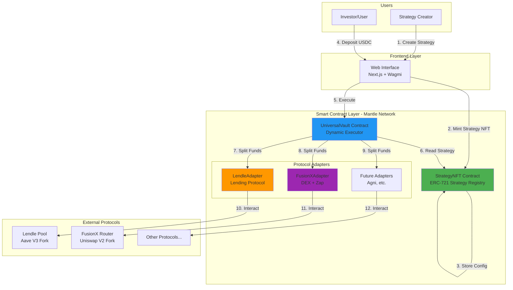
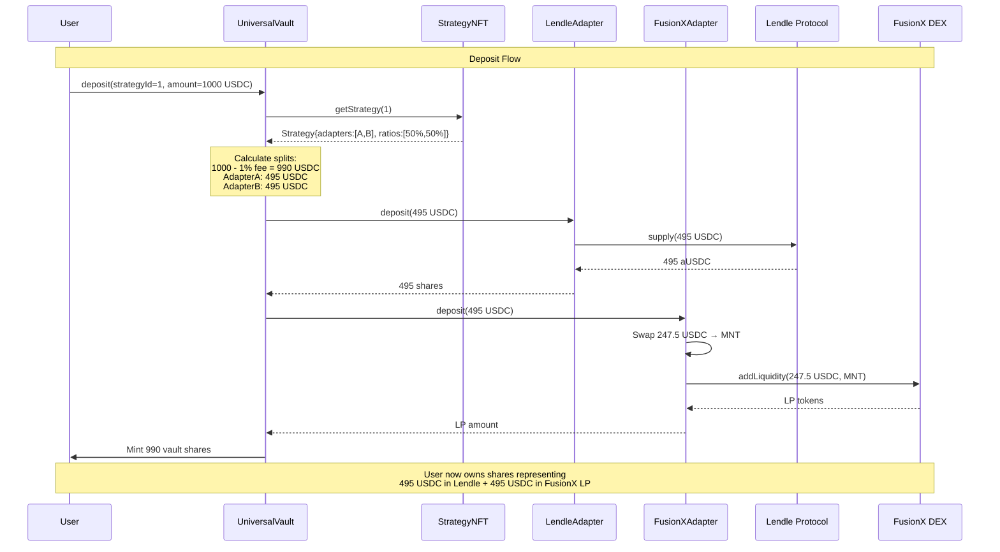
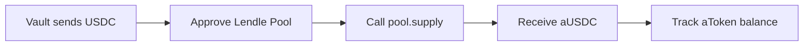
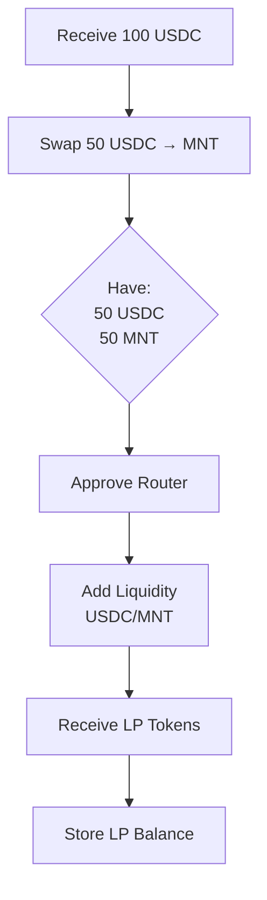
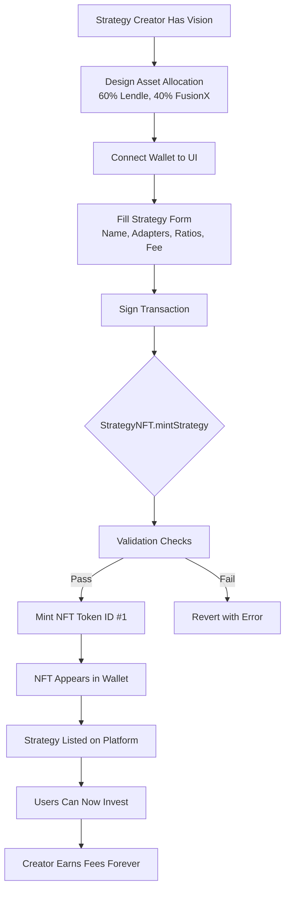
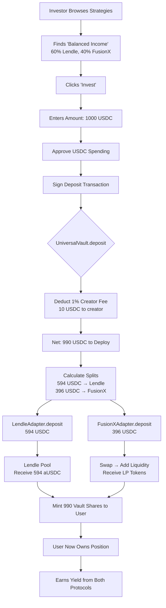
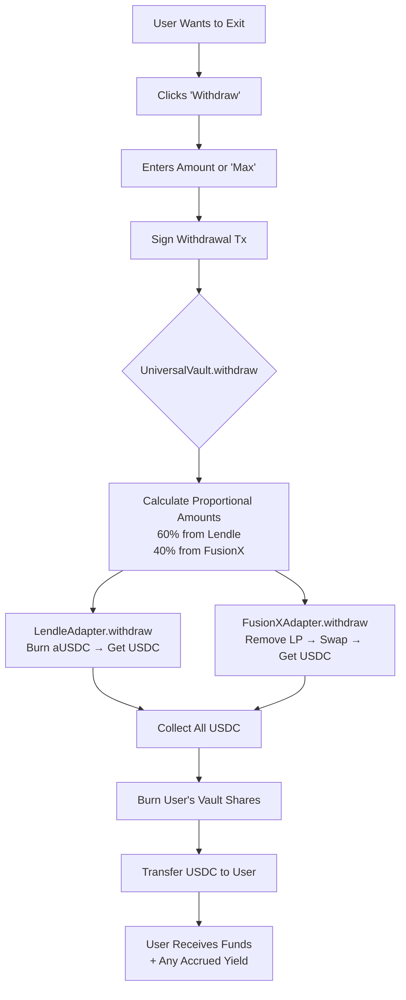
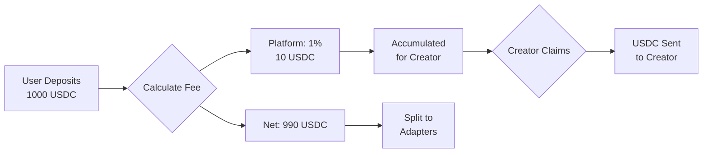

# Mantle Strategy Studio - Technical Documentation

**A Decentralized DeFi Strategy Marketplace on Mantle Network**

---

## Table of Contents

1. [Overview](#overview)
2. [Architecture](#architecture)
3. [Core Concepts](#core-concepts)
4. [Smart Contracts](#smart-contracts)
5. [User Flows](#user-flows)
6. [Technical Implementation](#technical-implementation)
7. [Security Considerations](#security-considerations)
8. [Deployment Guide](#deployment-guide)
9. [Examples](#examples)

---

## Overview

### What is Mantle Strategy Studio?

Mantle Strategy Studio is a **decentralized platform** that enables anyone to create, share, and monetize DeFi investment strategies on the Mantle Network. Think of it as the "App Store for DeFi strategies" where:

- **Strategy Creators** design optimal asset allocations across multiple protocols and earn fees
- **Investors** can one-click invest into professionally crafted strategies
- **Protocols** gain liquidity and user acquisition through strategy integrations

### Key Innovation: NFT-Based Strategy Storage

Unlike traditional DeFi platforms where strategies are hardcoded or managed off-chain, we store **strategy configurations directly on-chain as NFTs**. This makes strategies:

- ✅ **Permanent** - Cannot be censored or taken down
- ✅ **Tradeable** - Strategy NFTs can be bought/sold
- ✅ **Composable** - Can be used as collateral or in other DeFi apps
- ✅ **Transparent** - All parameters visible on-chain

---

## Architecture

### High-Level System Diagram



### Component Overview

| Component | Purpose | Key Functions |
|-----------|---------|---------------|
| **StrategyNFT** | On-chain strategy registry | Store allocations, manage ownership |
| **UniversalVault** | Dynamic strategy executor | Split deposits, manage withdrawals |
| **Adapters** | Protocol integrations | Standardized interface for each protocol |
| **Frontend** | User interface | Strategy browsing, deposit/withdrawal |

---

## Core Concepts

### 1. Strategy NFT

Each strategy is represented as an **ERC-721 NFT** containing:

```solidity
struct Strategy {
    string name;                 // e.g., "Balanced 50/50"
    address[] adapters;          // [LendleAdapter, FusionXAdapter]
    uint16[] ratios;            // [5000, 5000] = 50% each (basis points)
    address creator;             // Strategy creator's address
    uint16 creatorFeeBps;       // Creator fee (0-500 = 0-5%)
    bool isActive;              // Can users deposit?
}
```

**Example Strategy:**
```json
{
  "name": "Conservative Income",
  "adapters": ["0xLendle...", "0xReserve..."],
  "ratios": [8000, 2000],
  "creator": "0xAlice...",
  "creatorFeeBps": 50,
  "isActive": true
}
```

This means:
- 80% → Lendle (lending)
- 20% → Reserve (cash)
- Creator earns 0.5% fee
- Strategy is active for deposits

### 2. Universal Vault

The **UniversalVault** is a single smart contract that can execute ANY strategy by:

1. Reading the strategy configuration from the NFT
2. Dynamically splitting user deposits according to ratios
3. Calling the appropriate adapters
4. Managing user shares and fees

**This is revolutionary because:**
- ❌ Traditional: Need to deploy a new vault for each strategy
- ✅ Our approach: One vault, infinite strategies

### 3. Protocol Adapters

Adapters implement a **standard interface** (`IAdapter`) that abstracts protocol complexity:

```solidity
interface IAdapter {
    function deposit(uint256 amount) external returns (uint256 shares);
    function withdraw(uint256 amount) external returns (uint256 withdrawn);
    function getBalance() external view returns (uint256 balance);
    function token() external view returns (address tokenAddress);
}
```

**Current Adapters:**

**LendleAdapter** (Lending Protocol)
- Deposits USDC → Receives aUSDC
- Earns lending yield
- Simple, low-risk

**FusionXAdapter** (DEX Zap)
- Deposits USDC → Swaps 50% to MNT → Adds liquidity → Receives LP tokens
- Earns trading fees + LP rewards
- Higher risk, higher return

---

## Smart Contracts

### Contract Interaction Flow



### Core Smart Contracts Deep Dive

#### 1. StrategyNFT.sol (195 lines)

**Purpose:** Manage strategy creation and ownership

**Key Features:**
- ERC-721 NFT implementation
- Adapter whitelist for security
- Strategy deactivation mechanism
- Creator fee limits (max 5%)

**Critical Functions:**

```solidity
function mintStrategy(
    string memory name,
    address[] memory adapters,
    uint16[] memory ratios,
    uint16 creatorFeeBps
) external returns (uint256 tokenId);
```

**Validations:**
- ✅ Ratios sum to exactly 10000 (100%)
- ✅ All adapters are whitelisted
- ✅ Creator fee ≤ 500 basis points (5%)
- ✅ No zero ratios allowed
- ✅ Arrays have matching lengths

**Events:**
```solidity
event StrategyMinted(
    uint256 indexed tokenId,
    address indexed creator,
    string name,
    address[] adapters,
    uint16[] ratios
);
```

#### 2. UniversalVault.sol (265 lines)

**Purpose:** Execute strategies dynamically

**Key Features:**
- Reads configuration from StrategyNFT at runtime
- Dynamic deposit splitting
- Fee accumulation for creators
- Proportional withdrawal from multiple adapters

**State Variables:**
```solidity
IERC20 public immutable ASSET;              // USDC
StrategyNFT public immutable STRATEGY_NFT;  // NFT contract
mapping(uint256 => mapping(address => uint256)) public userShares;
mapping(uint256 => uint256) public accumulatedCreatorFees;
uint16 public constant CREATOR_FEE_BPS = 100;  // 1% platform fee
```

**Critical Functions:**

**Deposit:**
```solidity
function deposit(uint256 strategyId, uint256 assets) 
    external nonReentrant returns (uint256 shares)
{
    // 1. Validate strategy is active
    Strategy memory strategy = STRATEGY_NFT.getStrategy(strategyId);
    require(strategy.isActive);
    
    // 2. Transfer USDC from user
    ASSET.safeTransferFrom(msg.sender, address(this), assets);
    
    // 3. Deduct 1% creator fee
    uint256 fee = (assets * CREATOR_FEE_BPS) / 10000;
    uint256 netAssets = assets - fee;
    accumulatedCreatorFees[strategyId] += fee;
    
    // 4. Execute strategy (split across adapters)
    _executeStrategyDeposit(strategy.adapters, strategy.ratios, netAssets);
    
    // 5. Mint shares to user (1:1 for MVP)
    shares = netAssets;
    userShares[strategyId][msg.sender] += shares;
    
    return shares;
}
```

**Internal Deposit Splitting:**
```solidity
function _executeStrategyDeposit(
    address[] memory adapters,
    uint16[] memory ratios,
    uint256 amount
) internal {
    uint256 remaining = amount;
    
    for (uint256 i = 0; i < adapters.length; i++) {
        uint256 adapterAmount;
        
        // Last adapter gets remainder (handles rounding)
        if (i == adapters.length - 1) {
            adapterAmount = remaining;
        } else {
            adapterAmount = (amount * ratios[i]) / 10000;
            remaining -= adapterAmount;
        }
        
        // Safe approval pattern
        ASSET.forceApprove(adapters[i], adapterAmount);
        IAdapter(adapters[i]).deposit(adapterAmount);
        ASSET.forceApprove(adapters[i], 0);  // Reset for security
    }
}
```

**Why this pattern?**
- ✅ Last adapter gets remainder → Ensures 100% of funds deployed
- ✅ Approve → Deposit → Reset → Secure approval management
- ✅ No dust left in vault

#### 3. LendleAdapter.sol (165 lines)

**Purpose:** Integrate with Lendle lending protocol

**Flow:**


**Key Code:**
```solidity
function deposit(uint256 amount) external onlyVault returns (uint256 shares) {
    // Transfer USDC from vault
    _ASSET.safeTransferFrom(msg.sender, address(this), amount);
    
    // Approve lending pool
    _ASSET.forceApprove(address(_LENDING_POOL), amount);
    
    // Supply to Lendle (aTokens minted to this contract)
    _LENDING_POOL.supply(address(_ASSET), amount, address(this), 0);
    
    // Reset approval
    _ASSET.forceApprove(address(_LENDING_POOL), 0);
    
    // Return aToken balance increase
    return amount;  // Simplified 1:1 for MVP
}
```

#### 4. FusionXAdapter.sol (323 lines)

**Purpose:** Zap into DEX liquidity pools

**Complex Flow:**


**Zap Deposit Logic:**
```solidity
function deposit(uint256 amount) external onlyVault returns (uint256 shares) {
    // Transfer USDC
    _TOKEN_A.safeTransferFrom(msg.sender, address(this), amount);
    
    // Step 1: Swap 50% of USDC for MNT
    uint256 amountToSwap = amount / 2;
    uint256 amountRemaining = amount - amountToSwap;
    uint256 amountBReceived = _swapAForB(amountToSwap);
    
    // Step 2: Add liquidity with both tokens
    uint256 liquidity = _addLiquidity(amountRemaining, amountBReceived);
    
    return liquidity;  // Return LP token amount
}
```

**Withdrawal (Un-zap):**
```solidity
function withdraw(uint256 amount) external onlyVault returns (uint256 withdrawn) {
    // Step 1: Remove liquidity (get back USDC + MNT)
    (uint256 amountA, uint256 amountB) = _removeLiquidity(amount);
    
    // Step 2: Swap all MNT back to USDC
    uint256 amountAFromSwap = _swapBForA(amountB);
    
    // Step 3: Return total USDC to vault
    withdrawn = amountA + amountAFromSwap;
    _TOKEN_A.safeTransfer(_VAULT, withdrawn);
    
    return withdrawn;
}
```

---

## User Flows

### Flow 1: Strategy Creator Journey



**Real Example Transaction:**
```javascript
// Creator calls mintStrategy
const tx = await strategyNFT.mintStrategy(
  "Balanced Income",              // name
  [lendleAdapter, fusionXAdapter], // adapters
  [6000, 4000],                    // 60/40 split
  100                              // 1% creator fee
);

// Result: NFT #1 minted to creator's wallet
// Strategy is now live and investable
```

### Flow 2: Investor Deposit Journey



**Gas Efficiency:**
- One transaction deploys to multiple protocols
- User never interacts with Lendle or FusionX directly
- All complexity abstracted away

### Flow 3: Withdrawal Journey



---

## Technical Implementation

### Deposit Splitting Algorithm

**Problem:** How to split 1000 USDC across [60%, 40%] without dust?

**Solution:**
```solidity
uint256 remaining = 1000 USDC;

// Adapter 1 (60%)
adapterAmount = (1000 * 6000) / 10000 = 600 USDC
remaining = 1000 - 600 = 400 USDC

// Adapter 2 (40%) - gets remainder
adapterAmount = remaining = 400 USDC
```

**Result:** Perfect split, zero dust!

### Fee Mechanism



**Code:**
```solidity
uint256 creatorFee = (assets * CREATOR_FEE_BPS) / 10000;
uint256 netAssets = assets - creatorFee;
accumulatedCreatorFees[strategyId] += creatorFee;
```

### Safe Approval Pattern

**Why we reset approvals:**
```solidity
// ❌ Dangerous: Unlimited approval
token.approve(adapter, type(uint256).max);

// ✅ Safe: Exact approval + reset
token.forceApprove(adapter, exactAmount);
adapter.deposit(exactAmount);
token.forceApprove(adapter, 0);  // Reset to 0
```

**Benefits:**
- No lingering allowances
- Adapter can't drain funds later
- Defense in depth

### Share Accounting (MVP Simplification)

**Current:** 1 share = 1 USDC deposited (net of fees)

```solidity
shares = netAssets;  // Simplified 1:1
```

**Future:** Share price increases with yield
```solidity
shares = (netAssets * totalShares) / totalAssets;
```

This would allow yield to accrue to share value.

---

## Security Considerations

### Smart Contract Security

**1. Reentrancy Protection**
```solidity
contract UniversalVault is ReentrancyGuard {
    function deposit(...) external nonReentrant { ... }
    function withdraw(...) external nonReentrant { ... }
}
```

**2. Safe Token Operations**
```solidity
using SafeERC20 for IERC20;

// ✅ Safe (handles non-standard tokens)
token.safeTransfer(to, amount);
token.safeTransferFrom(from, to, amount);

// ❌ Unsafe (can silently fail)
token.transfer(to, amount);
```

**3. Input Validation**
```solidity
// Validate ratios sum to 100%
uint256 totalRatio;
for (uint256 i = 0; i < ratios.length; i++) {
    require(ratios[i] > 0, "Zero ratio not allowed");
    totalRatio += ratios[i];
}
require(totalRatio == 10000, "Must sum to 100%");
```

**4. Access Control**
```solidity
// Only vault can call adapters
modifier onlyVault() {
    if (msg.sender != _VAULT) revert OnlyVault();
    _;
}
```

**5. Strategy Validation**
```solidity
// Only whitelisted adapters
for (uint256 i = 0; i < adapters.length; i++) {
    require(whitelistedAdapters[adapters[i]], "Adapter not whitelisted");
}
```

### Attack Vectors & Mitigations

| Attack Vector | Mitigation |
|---------------|------------|
| **Reentrancy** | ReentrancyGuard on all state-changing functions |
| **Approval Exploit** | Reset approvals after each use |
| **Malicious Adapter** | Whitelist system + admin controls |
| **Ratio Manipulation** | Validate sum = 10000 on minting |
| **Creator Fee Griefing** | Cap at 5% maximum |
| **Inactive Strategy Trap** | Check isActive flag |
| **Integer Overflow** | Solidity 0.8.x built-in checks |

---

## Deployment Guide

### Step-by-Step Deployment

**1. Deploy Mock Ecosystem (Testnet):**
```bash
forge script script/Deploy.s.sol \
  --rpc-url https://rpc.sepolia.mantle.xyz \
  --private-key $PRIVATE_KEY \
  --broadcast \
  -vvvv
```

**Deploys:**
- MockERC20 (USDC, aUSDC, WMNT)
- MockLendingPool
- MockUniswapV2Router & Pair
- StrategyNFT
- UniversalVault
- LendleAdapter
- FusionXAdapter

**2. Verify Contracts:**
```bash
forge verify-contract $STRATEGY_NFT \
  src/StrategyNFT.sol:StrategyNFT \
  --chain-id 5003 \
  --rpc-url https://rpc.sepolia.mantle.xyz
```

**3. Test Deployment:**
```bash
# Mint test USDC
cast send $USDC "mint(address,uint256)" $YOUR_ADDRESS 10000000000

# Mint a strategy
cast send $STRATEGY_NFT \
  "mintStrategy(string,address[],uint16[],uint16)" \
  "Test Strategy" \
  "[$LENDLE_ADAPTER,$FUSIONX_ADAPTER]" \
  "[5000,5000]" \
  100
```

---

## Examples

### Example 1: Conservative Strategy

**Target User:** Risk-averse, wants stable yield

```solidity
Strategy {
    name: "Safe Haven",
    adapters: [LendleAdapter],
    ratios: [10000],  // 100% Lendle
    creator: 0xAlice,
    creatorFeeBps: 30,  // 0.3% fee
    isActive: true
}
```

**Expected APY:** 4-6% (lending yield)
**Risk Level:** Low
**Use Case:** Beginners, conservative investors

### Example 2: Balanced Strategy

**Target User:** Moderate risk tolerance

```solidity
Strategy {
    name: "50/50 Balanced",
    adapters: [LendleAdapter, FusionXAdapter],
    ratios: [5000, 5000],
    creator: 0xBob,
    creatorFeeBps: 100,  // 1% fee
    isActive: true
}
```

**Expected APY:** 8-12%
**Risk Level:** Medium
**Use Case:** Most users, balanced approach

### Example 3: Aggressive Strategy

**Target User:** High risk, high reward

```solidity
Strategy {
    name: "Degen Yield Maximizer",
    adapters: [FusionXAdapter, FusionXVolatileAdapter],
    ratios: [5000, 5000],
    creator: 0xCharlie,
    creatorFeeBps: 200,  // 2% fee
    isActive: true
}
```

**Expected APY:** 20-50%
**Risk Level:** High
**Use Case:** DeFi natives, yield farmers

### Example 4: DAO Treasury

**Target User:** DAOs managing treasuries

```solidity
Strategy {
    name: "DAO Conservative Treasury",
    adapters: [LendleAdapter, StablecoinReserve],
    ratios: [7000, 3000],  // 70% earning, 30% liquid
    creator: 0xDAO,
    creatorFeeBps: 10,  // 0.1% fee
    isActive: true
}
```

**Expected APY:** 3-5%
**Risk Level:** Very Low
**Use Case:** Treasury management, operational funds

---

## Testing

### Test Coverage

**54 Comprehensive Tests:**

| Contract | Tests | Coverage |
|----------|-------|----------|
| StrategyNFT | 14 | 100% |
| UniversalVault | 14 | 100% |
| LendleAdapter | 10 | 100% |
| FusionXAdapter | 10 | 100% |
| Integration | 6 | 100% |

**Run Tests:**
```bash
# All tests
forge test -vv

# Specific contract
forge test --match-contract Integration -vvv

# With gas reporting
forge test --gas-report
```

**Example Test:**
```solidity
function testE2E_MultiAdapterStrategy() public {
    // 1. Create 50/50 strategy
    vm.prank(creator);
    uint256 strategyId = strategyNFT.mintStrategy(
        "Balanced",
        [lendleAdapter, fusionXAdapter],
        [5000, 5000],
        100
    );
    
    // 2. User deposits 1000 USDC
    vm.prank(alice);
    uint256 shares = vault.deposit(strategyId, 1000e6);
    
    // 3. Verify splits
    assertApproxEqRel(lendleAdapter.getBalance(), 495e6, 0.01e18);
    assertGt(fusionXAdapter.getBalance(), 0);
    
    // 4. Verify shares
    assertEq(shares, 990e6);  // 1000 - 1% fee
}
```

---

## Gas Optimization

### Gas Costs (Estimated)

| Operation | Gas Cost | USD (@ $0.001/gas) |
|-----------|----------|-------------------|
| Mint Strategy | ~200K | $0.20 |
| Deposit (2 adapters) | ~350K | $0.35 |
| Withdraw | ~300K | $0.30 |
| Claim Creator Fees | ~50K | $0.05 |

**On Mantle (L2):** ~100x cheaper than Ethereum mainnet!

### Optimization Techniques

1. **Pack structs efficiently**
```solidity
struct Strategy {
    string name;           // Dynamic
    address[] adapters;    // Dynamic
    uint16[] ratios;      // uint16 instead of uint256
    address creator;       // 160 bits
    uint16 creatorFeeBps; // Packed with creator
    bool isActive;        // Packed with creator
}
```

2. **Use immutables for constants**
```solidity
IERC20 public immutable ASSET;
StrategyNFT public immutable STRATEGY_NFT;
```

3. **Minimize storage writes**
```solidity
// ❌ Multiple writes
userShares[strategyId][user] = 0;
totalShares[strategyId] = 0;

// ✅ Batch in one function
delete userShares[strategyId][user];
delete totalShares[strategyId];
```

---

## Future Enhancements

### Roadmap Features

**Q1 2025:**
- [ ] Auto-rebalancing (maintain target ratios)
- [ ] Time-locked strategies (vesting)
- [ ] Strategy performance metrics

**Q2 2025:**
- [ ] Flash loan integration
- [ ] Leveraged strategies
- [ ] Cross-chain bridges

**Q3 2025:**
- [ ] Governance token ($STUDIO)
- [ ] DAO-managed adapter whitelist
- [ ] Strategy marketplace v2

**Q4 2025:**
- [ ] Multi-chain deployment
- [ ] Institutional features
- [ ] Audit reports & insurance

---

## Resources

**Documentation:**
- [Deployment Guide](./DEPLOYMENT.md)
- [Quick Deploy](./QUICK_DEPLOY.md)
- [Verification Guide](./VERIFICATION.md)
- [Pitch Deck](./PITCH_DECK.md)

**Code:**
- GitHub: [Link]
- Deployed Contracts: [Mantle Sepolia]
- Block Explorer: https://sepolia.mantlescan.xyz/

**Community:**
- Discord: [Link]
- Twitter: [Link]
- Documentation: [Link]

---

## Conclusion

Mantle Strategy Studio represents a **paradigm shift** in DeFi:

✅ **For Users:** Complex multi-protocol strategies in one click
✅ **For Creators:** Monetize expertise through strategy NFTs
✅ **For Protocols:** Gain users and liquidity through integrations
✅ **For DeFi:** More efficient capital allocation across the ecosystem

The platform is **live on Mantle Sepolia testnet** with full smart contract suite, comprehensive testing, and production-ready code.

**Try it today:** [Testnet Demo Link]

---

*Built with ❤️ on Mantle Network*
